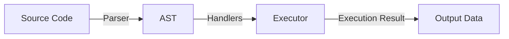
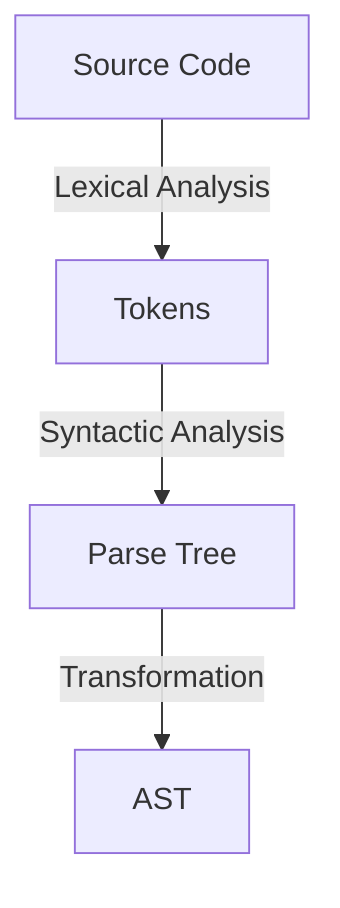
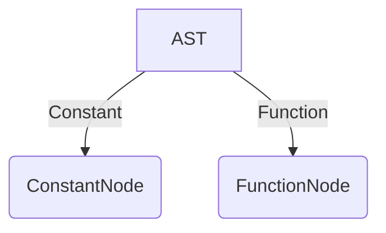
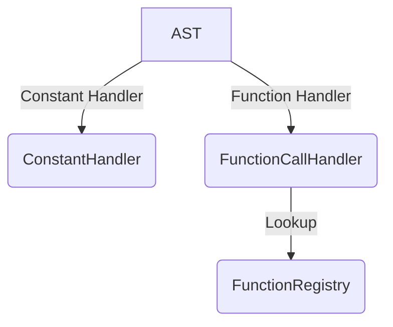
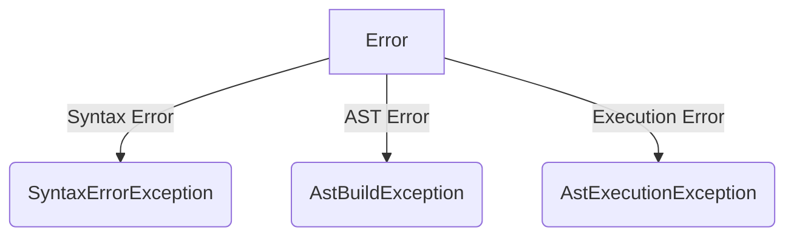

# Functional Language Interpreter

## Project Architecture

The project is a **functional programming language interpreter** written in **PHP**. The architecture follows a classic structure: **parsing → AST construction → code execution**.

---

## Overall System Workflow

The overall architecture consists of sequential steps, starting from parsing and ending with code execution.



---

## Parser (`Parser/`)

The parser analyzes the input code and converts it into an [Abstract Syntax Tree](https://en.wikipedia.org/wiki/Abstract_syntax_tree) (AST). **[ANTLR](https://www.antlr.org/)** is used for this purpose.

The **[FunctionalLang.g4](../FunctionalLang.g4)** file defines the syntax rules for the ANTLR parser. This file specifies how source code is tokenized and structured into a parse tree before being transformed into an Abstract Syntax Tree (AST).

### Parser Workflow:

1. **Lexical Analysis** – `FunctionalLangLexer.php` tokenizes the source code.
2. **Syntactic Analysis** – `FunctionalLangParser.php` builds the parse tree.
3. **AST Transformation** – `AstBuilder.php` constructs AST nodes.



---

## Abstract Syntax Tree (AST) (`Ast/`)

AST represents the code as a tree of nodes. The key node types include:

- **Constants** (`ConstantNode.php`)
- **Functions** (`FunctionNode.php`)



### Example AST in JSON Format

Below is an example representation of an AST in JSON format:

```json
{
    "function": "bk.action.string.Concat",
    "args": [
        {
            "constant": "\"Hello, \""
        },
        {
            "function": "bk.action.core.GetArg",
            "args": [
                {
                    "constant": "0"
                }
            ]
        }
    ]
}
```

See advanced AST example: [ast-example.json](./ast-example.json).

---

## Code Execution (`Executor/`)

Handles AST nodes using specific handlers:

- **`ConstantHandler.php`** – Processes constants.
- **`FunctionCallHandler.php`** – Handles function calls.
- **`FunctionRegistry.php`** – Stores built-in functions.



---

## Handlers and Custom Function Support

Handlers process different types of AST nodes, making the interpreter extensible.

### Adding Custom Functions

To extend the language, developers can add functions by:

1. Creating a class in `Executor/Functions/` implementing `FunctionInterface`.
2. Registering the function in `FunctionRegistry.php`.

Example:

```php
class CustomFunction implements FunctionInterface {
    public function execute(array $args) {
        return array_sum($args); // Example: Sum function
    }
}
```

### Registering Functions in `FunctionRegistry`

```php
FunctionRegistry::register('sum', new CustomFunction());
```

This allows easy function extension without modifying core components.

---

## Error Handling (`Exceptions/`)

The parser includes syntax validation and reports errors when incorrect syntax is detected. Example Error Message:
```plaintext
Error: Syntax error at line 10, position 1: missing ')' at '<EOF>'
```
Errors are managed using dedicated classes:

- **`SyntaxErrorException.php`** – Handles syntax errors.
- **`AstBuildException.php`** – Errors during AST construction.
- **`AstExecutionException.php`** – Errors during execution.



---

## Conclusion

The project follows a **three-stage interpreter architecture**:

1. **Parsing** – Analyzing code using **ANTLR**.
2. **AST Transformation** – Representing the program as a tree of nodes.
3. **Execution** – Processing AST and executing commands.

This structure allows for **language extensibility** by adding new functions and **simplifies debugging** by separating analysis from execution.

